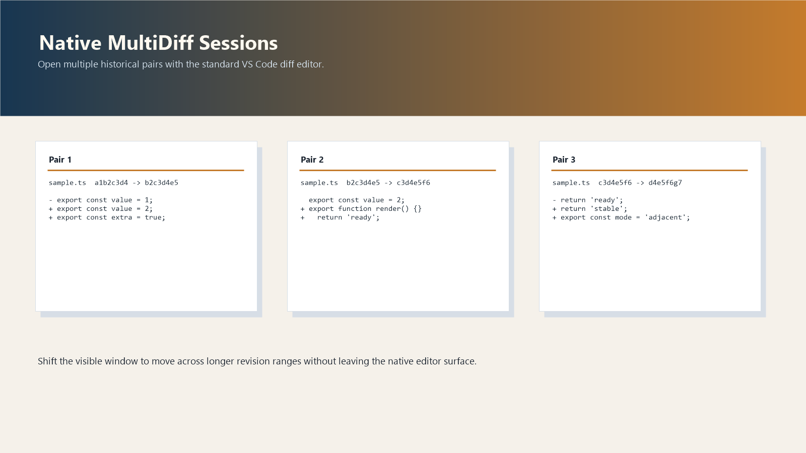
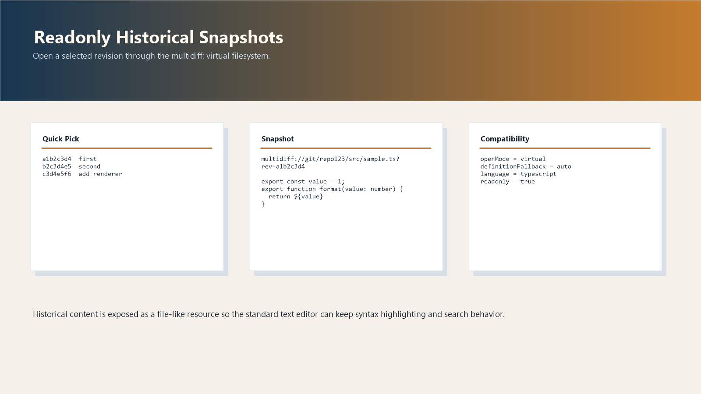

# Fukusa

Fukusa is a VS Code extension for historical N-way compare. It keeps the main compare surface in native editors, supports a single-tab panel surface, and works with Git or SVN working copies.

## Prerequisites

- VS Code 1.85.0 or later
- Git CLI for Git repositories
- SVN CLI for SVN repositories
- The built-in `vscode.git` extension for Git-backed workflows
- Node.js 20+ if you want to build or run the extension from source

## Install

### From a VSIX

```powershell
code --install-extension .\fukusa-0.0.1.vsix
```

### From source

```powershell
npm install
npm run compile
```

Open the repository in VS Code and press `F5` to launch the extension host.

## Screenshots

Native multi-editor compare:



Single-tab compare panel:



## Main Commands

| Command | Purpose |
| --- | --- |
| `Fukusa: Browse Revisions` | Open a native-editor compare session for 2 or more revisions. |
| `Fukusa: Browse Revisions (Single-Tab)` | Open the same session model in one webview panel. |
| `Fukusa: Change Pair Projection` | Switch between `Adjacent`, `Base`, `All`, and `Custom`. |
| `Fukusa: Switch Compare Surface` | Move the active session between native editors and the panel. |
| `Fukusa: Toggle Collapse Unchanged` | Toggle shared row projection for the active session. |
| `Fukusa: Open Active Session Snapshot` | Open the focused historical revision. |
| `Fukusa: Open Active Session Pair Diff` | Open a native two-way diff for the focused pair. |

## Settings

| Setting | Purpose |
| --- | --- |
| `multidiff.blame.mode` | Selects the blame heatmap mode. |
| `multidiff.blame.showOverviewRuler` | Shows blame colors in the overview ruler. |
| `multidiff.cache.maxSizeMb` | Limits in-memory cache size in MiB. |
| `multidiff.snapshot.openMode` | Chooses virtual `multidiff:` documents or mirrored temp files for snapshots. |

## Documentation

| File | Notes |
| --- | --- |
| `CLAUDE.md` | Agent-facing development guide. |
| `CHANGELOG.md` | Release history in Keep a Changelog format. |
| `PUBLISHING.md` | Marketplace publishing checklist. |
| `docs/N_WAY_PARITY_AUDIT.md` | Living parity audit and progress tracker against native 2-way diff UX. |
| `docs/USER_GUIDE.md` | End-user guide. |
| `docs/SPEC.md` | Reverse-engineered specification. |
| `docs/archive/Fukusa_design_v0.2.md` | Deprecated design document archive. |
| `docs/adr_001_*` to `docs/adr_010_*` | Architecture Decision Records. |
